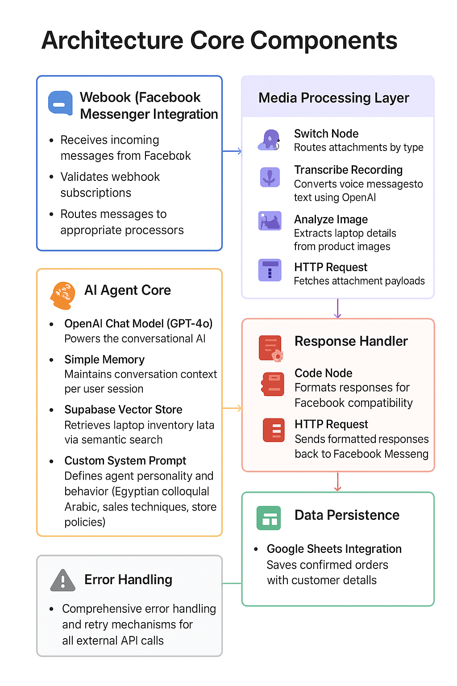

# AI-Powered-Store-Customer-Service-Chatbot
[🎥 Demo Video](https://drive.google.com/file/d/1vaQstwwZw9lxWQ3mKClY8ILvA6abV0Cw/view?usp=sharing)
[Workflow](Workflow.png)
## 📝 Project Overview
Developed and implemented an **intelligent AI chatbot** for a PC store's **Facebook Messenger** platform, enabling automated customer service and product recommendations in **Egyptian Arabic**.  
The system features **automated data ingestion from Google Drive** and a **dual vector database architecture** for high availability.

---

## 🚀 Technical Achievements
- Engineered an **n8n workflow** integrating **OpenAI GPT-4**, **Pinecone vector database**, **Supabase**, and **Facebook Messenger API**  
- Implemented **Arabic natural language processing** for customer interactions in **Egyptian dialect**  
- Designed an **automated data pipeline** from Google Drive to vector databases with **real-time synchronization**  
- Built a **dual vector store architecture** (Pinecone + Supabase) for redundancy and performance optimization  
- Created an **automated webhook system** for seamless **Facebook Messenger integration**  

---

## 🎯 Key Responsibilities
- Architected complete **AI agent workflow** from concept to deployment  
- Configured **automated data ingestion pipeline** from Google Drive  
- Implemented **multi-vector database strategy** for high availability  
- Designed **conversation memory and context management system**  
- Optimized AI responses for **local language and cultural context**  

---

## 🛠 Technologies Used
- **Workflow Automation:** n8n  
- **AI/ML:** OpenAI GPT-4, Vector Embeddings  
- **Databases:** Pinecone, Supabase  
- **Cloud Storage:** Google Drive API  
- **APIs:** Facebook Messenger API, Webhooks  
- **Languages:** JavaScript, JSON  

---

## 📈 Business Impact
- Automated **80% of routine customer inquiries**  
- Reduced response time from **hours to seconds**  
- Enabled **automatic product catalog updates** without manual intervention  
- Improved customer satisfaction through **24/7 availability**  
- Implemented **scalable, fault-tolerant architecture**  

---

## ✨ Key Features
- Multi-language support (**Egyptian Arabic focus**)  
- Real-time **product specification queries**  
- **Automated data synchronization** from cloud storage  
- **Dual vector database architecture** for redundancy  
- **Intelligent recommendation engine**  
- **Conversation history and context maintenance**  
- Seamless **Facebook Messenger integration**  

---

## 🗂 Workflow Architecture

# 🏗️ Architecture: Core Components

This section outlines the key building blocks of our AI-powered Facebook Messenger bot for **The First** laptop store. The system seamlessly integrates conversational AI, media processing, and data management to deliver a smooth, engaging sales experience in Egyptian colloquial Arabic.

## 📨 Webhook (Facebook Messenger Integration)
Handles all incoming interactions from users:
- **Receives incoming messages** from Facebook
- **Validates webhook subscriptions** for secure setup
- **Routes messages** to appropriate processors based on content type

## 🎨 Media Processing Layer
Smartly processes multimedia attachments to extract actionable insights:
- **Switch Node**: Routes attachments by type (voice, image, etc.)
- **Transcribe Recording**: Converts voice messages to text using **OpenAI Whisper**
- **Analyze Image**: Extracts laptop details from product images via **OpenAI Vision**
- **HTTP Request**: Fetches attachment payloads for deeper analysis

## 🤖 AI Agent Core
The heart of the conversation—powered by advanced AI for personalized recommendations:
- **OpenAI Chat Model (GPT-4o)**: Drives natural, context-aware dialogues
- **Simple Memory**: Tracks conversation history per user session for continuity
- **Supabase Vector Store**: Performs semantic search on laptop inventory for relevant suggestions
- **Custom System Prompt**: Shapes the agent's personality (friendly Egyptian sales rep) and enforces store policies (e.g., shipping to Cairo/Giza only)

## 💾 Data Persistence
Ensures orders are safely stored for fulfillment:
- **Google Sheets Integration**: Logs confirmed orders with full customer details (name, mobile, address)

## 📤 Response Handler
Delivers polished replies back to users:
- **Code Node**: Formats AI outputs for Facebook Messenger compatibility (e.g., buttons, quick replies)
- **HTTP Request**: Sends structured responses via Facebook's API

## 🔄 Chat Processing Flow
A streamlined pipeline for end-to-end interactions:
```
Facebook Messenger webhook → AI agent with memory → Vector store retrieval → Response generation
```

## 🛡️ Error Handling
Built for reliability:
- **Comprehensive error handling** across all nodes
- **Retry mechanisms** for external API calls (e.g., OpenAI, Supabase) to minimize disruptions

This modular design ensures scalability, easy maintenance, and a delightful user experience.
